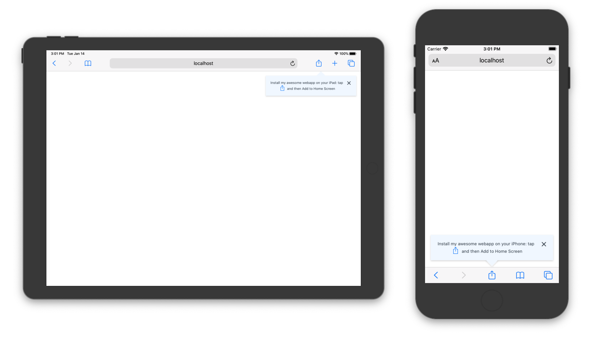

# pwa-ios-invitation [](https://www.npmjs.com/package/pwa-ios-invitation) 

PWA invitation react component for iOS (located in right place for different devices) and few utils usefull for PWA.



### `<PwaIosInstallInvitation/>`

PWA invitation component on iOS style, located in a bottom for iPhones portrait and in top for iPad and iPhones (greater iPhone SE) landscape 

```jsx
import React from 'react'
import PwaIosInstallInvitation, { IconShareIos, IconHomeScreen } from 'pwa-const-and-invitation'

ReactDOM.render(
  <>
    <App />

    <PwaIosInstallInvitation
      showPwaInvitation={true}
      iosInvitationTimeout={10000}
      iosInvitationOnlySafari={true}
      iosInvitationHeader={(iosDevice) => `Install this webapp on your ${iosDevice}`}
      iosInvitationContent={
        <>
          Open this page in Safari, tap <IconShareIos /> and then <br></br>
          Add to Home Screen <IconHomeScreen />
        </>
      }
    />
  </>,
  document.getElementById('root')
)
```

| Prop / Const                    | Type                               | Default                                                                                       | Description                                                                          |
| ----------------------- | ---------------------------------- | --------------------------------------------------------------------------------------------- | ------------------------------------------------------------------------------------ |
| showPwaInvitation       | bool or function::bool             | true                                                                                          | Value or function that set PWA invitation visablity. It's affect Android devices too |
| iosInvitationTimeout    | int                                | 0                                                                                             | Milliseconds after last closing PWA invitation on ios to show it again               |
| iosInvitationOnlySafari | bool                               | false                                                                                         | Set to true to show invitation on ios only in Safari                                 |
| iosInvitationContent    | string, jsx or function(iosDevice) |  | Ios invitation header  
| iosInvitationContent    | string, jsx or function(iosDevice) |  | Ios invitation content                                                               |
| --ios-install-invitation-bg    | css const | #f2f8ff | Component background color |
| --ios-install-invitation-text-color    | css const | #37434E | Component text color |


### Consts

Consts that can be usefull with PWA works

```jsx
// use this one to reduce bundle size, if you need only const
import { isPwa, isIos, iosDevice, isSafari } from 'pwa-const-and-invitation/const' 

// or you can use this one, if you use invitation too
import { isPwa, isIos, iosDevice, isSafari } from 'pwa-const-and-invitation'
```

| Prop      | Type   | Description                       |
| --------- | ------ | --------------------------------- |
| isPwa     | bool   | true if application run as PWA    |
| isIos     | bool   | equal true if device based on ios |
| iosDevice | string | iPhone or iPad or iPod            |
| isSafari  | bool   | true if it Safari and NOT Chrome  |


### IconShareIos, IconHomeScreen

Ios style "Share" and "Add to Home Screen" icons. It may be useful for iosInvitationHeader or iosInvitationContent

```jsx
import { IconShareIos, IconHomeScreen } from 'pwa-const-and-invitation'
```

| Prop      | Type   | Description                         |
| --------- | ------ | ----------------------------------- |
| className | string | Custom css class for icon component |


### useWindowBeforeInstallPrompt

Hook for default PWA install invitation event


```jsx
// use this one to reduce bundle size, if you need only const
import { useWindowBeforeInstallPrompt } from 'pwa-const-and-invitation/hooks'

// or you can use this one, if you use invitation too
import { useWindowBeforeInstallPrompt } from 'pwa-const-and-invitation'
```
